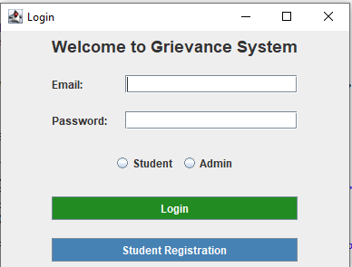
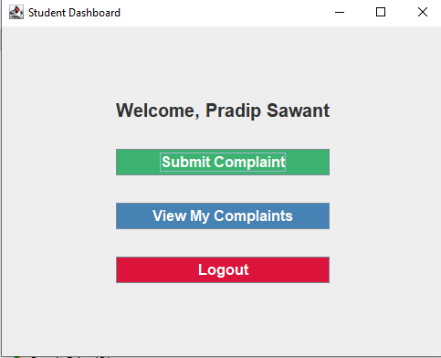
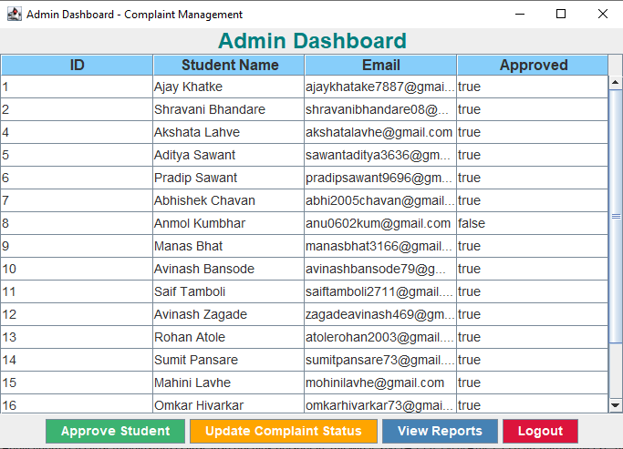
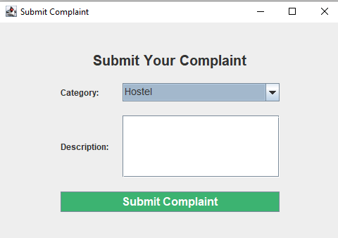
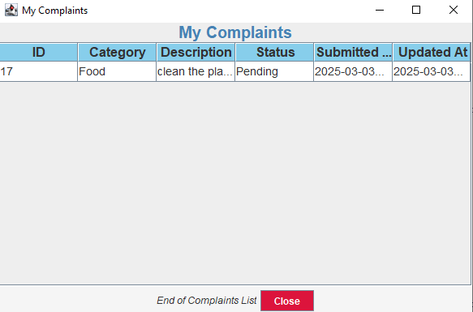

# Grievance System for Students

## Overview
The **Grievance System for Students** is a Java-based desktop application designed to help students register and track complaints related to **Hostel, Food, and Library** services. It features **user authentication, complaint submission, status tracking, and reporting functionalities**.

## Features
- **User Registration & Authentication**: Secure login for both students and admins.
- **Grievance Submission**: Students can lodge complaints in predefined categories.
- **Admin Dashboard**: Admins can manage complaints and approve student accounts.
- **Status Updates**: Students can track the progress of their complaints.
- **Reports & Analytics**: Generate reports for grievances based on category, status, and student details.
- **Email Notifications**: Automatic emails sent upon status updates.
- **Graphical User Interface (GUI)**: Developed using **Swing/AWT**.
- **Database Integration**: Uses **MySQL** with **Hibernate ORM**.

## Technologies Used
- **Java (Swing/AWT)** for GUI
- **Hibernate (ORM Framework)** for database operations
- **MySQL** for data storage
- **JUnit** for testing
- **Apache Maven** for dependency management
- **iTextPDF** for generating reports
- **JavaMail API** for sending email notifications

## Installation & Setup
### Prerequisites
Ensure you have the following installed:
- **Java JDK 8 or higher**
- **Apache Maven**
- **MySQL Server** (Ensure MySQL is running on `localhost:3306`)

### Steps to Run the Project
1. **Clone the repository:**
   ```sh
   git clone https://github.com/pansarey91/Grievance_System_Java_Hibernate.git
   ```
2. **Navigate to the project folder:**
   ```sh
   cd Grievance_System_Java_Hibernate
   ```
3. **Configure the Database:**
   - Create a MySQL database named `grievancedb`.
   - Update `hibernate.cfg.xml` with your MySQL username and password.
   - Run the application; Hibernate will automatically generate the required tables.

4. **Build the project using Maven:**
   ```sh
   mvn clean install
   ```
5. **Run the application:**
   ```sh
   java -jar target/agrievancesystem-0.0.1-SNAPSHOT.jar
   ```
## Screenshots
### Login Screen


### Student Dashboard


### Admin Dashboard


### Submit Complaint


### View Complaints


## Database Schema
The application consists of the following tables:
- `students` – Stores student details.
- `admin` – Stores admin login credentials.
- `complaints` – Stores complaint details, category, and status.

## Usage
### Student Workflow:
1. Register as a **Student**.
2. Wait for **Admin Approval**.
3. Login and submit a **Complaint**.
4. View the **Complaint Status**.

### Admin Workflow:
1. Login as **Admin**.
2. Approve new **Student Registrations**.
3. Review and **Update Complaint Status**.
4. Generate **Reports & Analytics**.

## Future Enhancements
- Mobile App Support (Android/iOS)
- AI Chatbot for automatic grievance handling
- Advanced filtering & search for complaints
- Export reports in CSV and Excel formats

## Contributors
- **Pansare Yash Viraj** (pansarey91@gmail.com)

